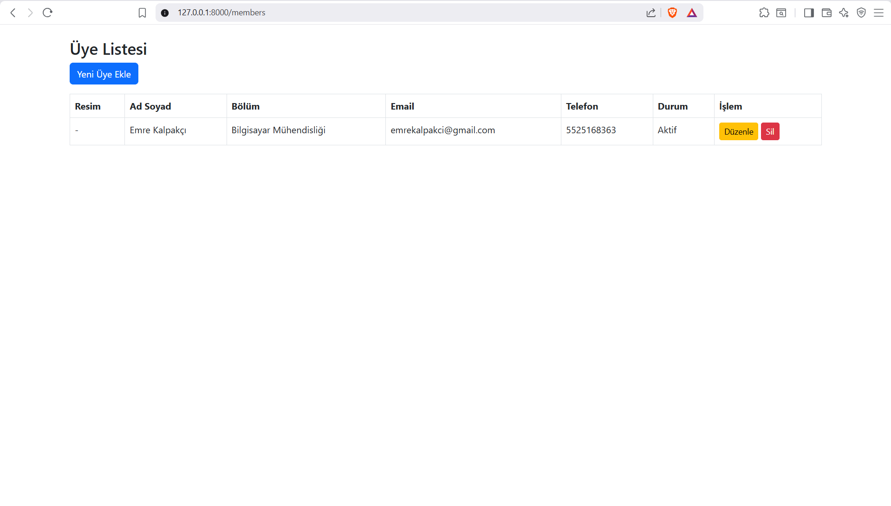
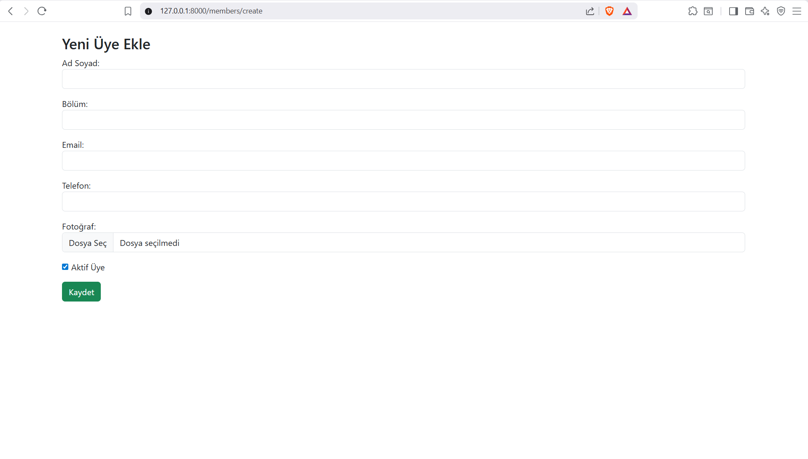
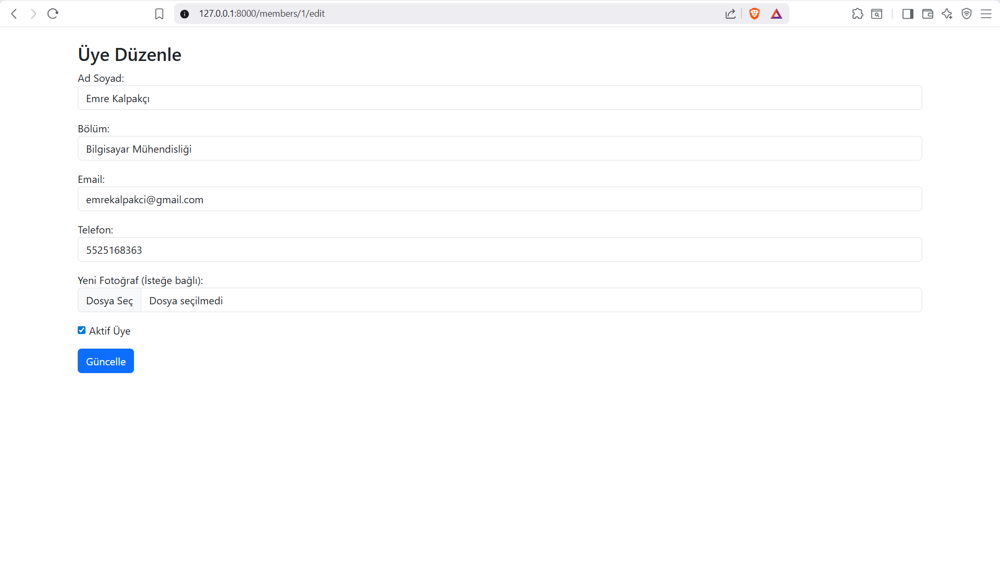

# Member Management System

A simple **member management web application** built with **Laravel 12**. It was developed as a student-club membership tracker and demonstrates a complete CRUD workflow, server-side validation, and image (profile photo) uploads.

> Members can be listed, created, edited, and deleted. Each member has a name, department, e-mail, phone number, active/passive status, and an optional profile photo.

## Features

- **Full CRUD** for members (Create, Read, Update, Delete)
- **Form validation** — required fields, unique e-mail, e-mail format, and phone-number rules
- **Profile photo upload** with image type and size (max 2 MB) checks
- **Active / passive status** toggle for each member
- **Bootstrap 5** responsive UI
- Clean RESTful routing with named routes

## Tech Stack

| Layer    | Technology            |
| -------- | --------------------- |
| Backend  | Laravel 12 (PHP 8.2+) |
| Database | MySQL                 |
| Frontend | Blade + Bootstrap 5   |
| Build    | Vite                  |

## Screenshots

### Member list


### Add a new member


### Edit a member


## Getting Started

### Requirements

- PHP 8.2+
- Composer
- MySQL
- Node.js & npm

### Installation

```bash
# 1. Clone the repository
git clone https://github.com/emrekalpakci/laravel-member-management.git
cd laravel-member-management

# 2. Install PHP dependencies
composer install

# 3. Install front-end dependencies
npm install

# 4. Create your environment file and generate an app key
cp .env.example .env
php artisan key:generate

# 5. Configure the database in .env (DB_DATABASE, DB_USERNAME, DB_PASSWORD)
#    then run the migrations
php artisan migrate

# 6. Start the development server
php artisan serve
```

The app will be available at **http://127.0.0.1:8000/members**.

> Uploaded photos are stored under `public/uploads`.

## Project Structure

```
app/
 ├─ Http/Controllers/MemberController.php   # CRUD logic
 └─ Models/Member.php                        # Eloquent model
database/
 └─ migrations/..._create_members_table.php  # members schema
resources/
 └─ views/members/                           # index, create, edit views
routes/
 └─ web.php                                  # member routes
```

## Data Model

| Field        | Type    | Notes                       |
| ------------ | ------- | --------------------------- |
| `full_name`  | string  | required, min 3 chars       |
| `department` | string  | required                    |
| `email`      | string  | required, valid, unique     |
| `phone`      | string  | required                    |
| `is_active`  | boolean | active / passive, default 1 |
| `photo`      | string  | optional image path         |

## Author

**Emre Kalpakçı** — [@emrekalpakci](https://github.com/emrekalpakci)

## License

Released under the [MIT License](https://opensource.org/licenses/MIT).
